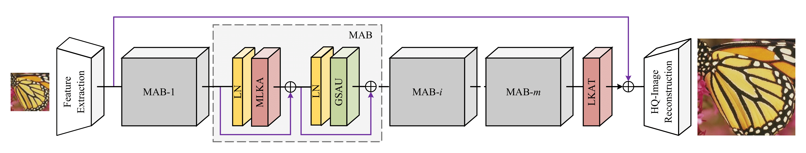
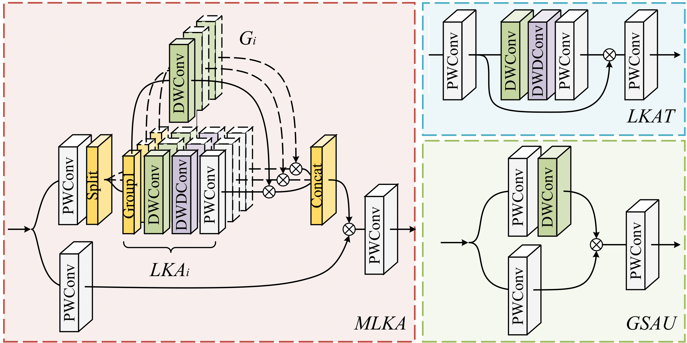
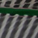
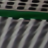
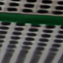
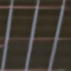
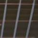
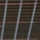
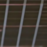
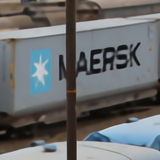

## <div align="center"> Multi-scale Attention Network for Single Image Super-Resolution </div>

<div align="center"> 

[Yan Wang](https://scholar.google.com/citations?user=SXIehvoAAAAJ&hl=en)<sup>†</sup>, [Yusen Li](https://scholar.google.com/citations?user=4EJ9aekAAAAJ&hl=en&oi=ao)<sup>†</sup>, Gang Wang, Xiaoguang Liu 
</div>

<p align="center"> Nankai University </p>

<p align="center">
<a href="https://arxiv.org/abs/2209.14145" alt="arXiv">
    </a>
<a href="https://github.com/icandle/MAN/blob/main/LICENSE" alt="license">
    </a>
<a href="https://github.com/icandle/MAN/blob/main/images/man_ntire24.pdf">
    </a>
</p>

**Overview:** To unleash the potential of ConvNet in super-resolution, we propose a multi-scale attention network (MAN), by coupling a classical multi-scale mechanism with emerging large kernel attention. In particular, we proposed multi-scale large kernel attention (MLKA) and gated spatial attention unit (GSAU). Experimental results illustrate that our MAN can perform on par with SwinIR and achieve varied trade-offs between state-of-the-art performance and computations.


This repository contains [PyTorch](https://pytorch.org/) implementation for ***MAN*** (CVPRW 2024).
<details> <summary>Table of contents</summary>
<p align="center">

1. [Requirements](#%EF%B8%8F-requirements)
2. [Datasets](#-datasets)
3. [Implementary Details](#-implementary-details)
4. [Train and Test](#%EF%B8%8F-train-and-test)
5. [Results and Models](#-results-and-models)
6. [Acknowledgments](#-acknowledgments)
7. [Citation](#-citation)

</p>
 
</details> 


---

⚙️ Requirements
---
- [PyTorch >= 1.8](https://pytorch.org/)
- [BasicSR >= 1.3.5](https://github.com/xinntao/BasicSR-examples/blob/master/README.md) 


🎈 Datasets
---

*Training*: [DIV2K](https://data.vision.ee.ethz.ch/cvl/DIV2K/) or [DF2K](https://openmmlab.medium.com/awesome-datasets-for-super-resolution-introduction-and-pre-processing-55f8501f8b18).

*Testing*: Set5, Set14, BSD100, Urban100, Manga109 ([Google Drive](https://drive.google.com/file/d/1SbdbpUZwWYDIEhvxQQaRsokySkcYJ8dq/view?usp=sharing)/[Baidu Netdisk](https://pan.baidu.com/s/1zfmkFK3liwNpW4NtPnWbrw?pwd=nbjl)).

*Preparing*: Please refer to the [Dataset Preparation](https://github.com/XPixelGroup/BasicSR/blob/master/docs/DatasetPreparation.md) of BasicSR.

🔎 Implementary Details
---

*Network architecture*: Group number (n_resgroups): *1 for simplicity*, MAB number (n_resblocks): *5/24/36*, channel width (n_feats): *48/60/180* for *tiny/light/base MAN*.
<p align="center">
     <br /></p>
    <em> Overview of the proposed MAN constituted of three components: the shallow feature extraction module (SF), the deep feature extraction module (DF) based on
    multiple multi-scale attention blocks (MAB), and the high-quality image reconstruction module. </em>
 
 &nbsp;

*Component details:* Three multi-scale decomposition modes are utilized in MLKA. The 7×7 depth-wise convolution is used in the GSAU.
<p align="center">
     <br /></p>
    <em> Details of Multi-scale Large Kernel Attention (MLKA), Gated Spatial Attention Unit (GSAU), and Large Kernel Attention Tail (LKAT). </em>
&nbsp;

▶️ Train and Test
---

The [BasicSR](https://github.com/XPixelGroup/BasicSR) framework is utilized to train our MAN, also testing. 

#### Training with the example option

```
CUDA_VISIBLE_DEVICES=0,1,2,3 \
python -m torch.distributed.launch --nproc_per_node=4 --master_port=4321 train.py -opt options/trian_MAN.yml --launcher pytorch
```
#### Testing with the example option

```
python test.py -opt options/test_MAN.yml
```

The training/testing results will be saved in the `./experiments` and `./results` folders, respectively.  

📊 Results and Models
---

Pretrained models available at [Google Drive](https://drive.google.com/drive/folders/1sARYFkVeTIFVCa2EnZg9TjZvirDvUNOL?usp=sharing) and [Baidu Netdisk](https://pan.baidu.com/s/15CTY-mgdTuOc1I8mzIA4Ug?pwd=mans) (pwd: **mans** for all links).

|HR (x4)|MAN-tiny|[EDSR-base+](https://github.com/sanghyun-son/EDSR-PyTorch)|MAN-light|[EDSR+](https://github.com/sanghyun-son/EDSR-PyTorch)|MAN|
|       :-----       |       :-----:       |     :-----:        |        :-----:         |        :-----:         |        :-----:         |
| | |||||
| | |||||
| | |||||
| | |||||
|**Params/FLOPs**| 150K/8G|1518K/114G|840K/47G|43090K/2895G|8712K/495G|

Results of our MAN-tiny/light/base models. Set5 validation set is used below to show the general performance. The visual results of five testsets are provided in the last column.

| Methods  |  Params   |  FLOPs   |PSNR/SSIM (x2)|PSNR/SSIM (x3)|PSNR/SSIM (x4)|Results|
|:---------|:---------:|:--------:|:------:|:------:|:------:|:--------:|
| MAN-tiny |      150K |     8.4G | 37.91/0.9603  |       34.23/0.9258      | 32.07/0.8930  | [x2](https://pan.baidu.com/s/1mYkGvAlz0bSZuCVubkpsmg?pwd=mans)/[x3](https://pan.baidu.com/s/1RP5gGu-QPXTkH1NPH7axag?pwd=mans)/[x4](https://pan.baidu.com/s/1u22su2bT4Pq_idVxAnqWdw?pwd=mans)    |
| MAN-light|      840K |    47.1G | 38.18/0.9612  | 34.65/0.9292  | 32.50/0.8988  | [x2](https://pan.baidu.com/s/1AVuPa7bsbb3qMQqMSM-IJQ?pwd=mans)/[x3](https://pan.baidu.com/s/1TRL7-Y23JddVOpEhH0ObEQ?pwd=mans)/[x4](https://pan.baidu.com/s/1T2bPZcjFRxAgMxGWtPv-Lw?pwd=mans) |
| MAN+     |     8712K |     495G | 38.44/0.9623  | 34.97/0.9315  | 32.87/0.9030  | [x2](https://pan.baidu.com/s/1pTb3Fob_7MOxMKIdopI0hQ?pwd=mans)/[x3](https://pan.baidu.com/s/1L3HEtcraU8Y9VY-HpCZdfg?pwd=mans)/[x4](https://pan.baidu.com/s/1FCNqht9zi9HecG3ExRdeWQ?pwd=mans) |

💖 Acknowledgments
--- 

We would thank [VAN](https://github.com/Visual-Attention-Network/VAN-Classification) and [BasicSR](https://github.com/XPixelGroup/BasicSR) for their enlightening work!

🎓 Citation
---
```
@inproceedings{wang2024multi,
  title={Multi-scale Attention Network for Single Image Super-Resolution},
  author={Wang, Yan and Li, Yusen and Wang, Gang and Liu, Xiaoguang},
  booktitle={Proceedings of the IEEE/CVF Conference on Computer Vision and Pattern Recognition (CVPR) Workshops},
  year={2024}
}
```

or

```
@article{wang2022multi,
  title={Multi-scale Attention Network for Single Image Super-Resolution},
  author={Wang, Yan and Li, Yusen and Wang, Gang and Liu, Xiaoguang},
  journal={arXiv preprint arXiv:2209.14145},
  year={2022}
}
```
