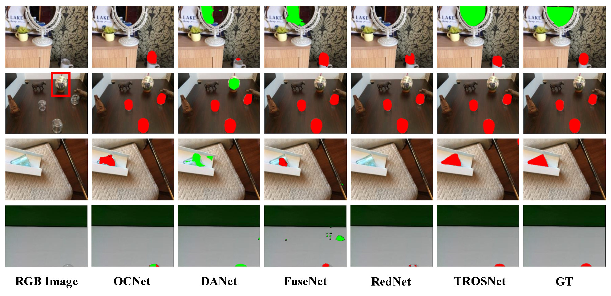

# TROSNet 

This repo is the implementation of TROSNet, a baseline method for transparent and reflective object segmentation. Project page at <a href="https://provemj.github.io/trosd.github.io/">here</a>. 

Some more details are also disclosed in <a href="https://codeocean.com/capsule/8854419/tree/v1">CodeOcean</a>. 

## Environment
 
The necessary packages will be imported after running the following code. 

    pip install -r requirements.txt

## File composition

The "**experiment**" folder contains all training and testing code. Besides the code in folder "**TROS**", there is also other code for ablation study. 

The "**weights**" folder contains the pth file of the backbone network structure. Users should be downloading the corresponding pth file to this directory. 

The "**lib**" folder contains the code of the network structure, the implementation of various datasets(including TROSD), and some evaluation metrics needed. 

As for prediction results, the image results are put into "**image**" folder, prediction metrics are in "**log**" folder, and the pth file of the best prediction model is saved in "**model**" folder. 

Our TROSD is accessible by <a href="https://drive.google.com/file/d/1KCGtPWqVgCkKhqidauXiDNQDHDXwIWzC/view?usp=sharing">Google Drive</a>. 

## Training

The training of TROSNet requires the following code. 

    cd /experiment/TROS/
    python train.py

## Testing

The testing of TROSNet requires the following code. 

    cd /experiment/TROS/
    python test_crf.py

Some of the segmentation results are shown below. Red pixels denote transparent objects and green pixels denote reflective objects. 



## TROSD structure

Since TROSD is not attached to the supplementary material, we only give the structure of TROSD in this README file. 

```
TROSD
|
├── train
│   ├── rgb
|   |      ├── old_1.jpg
|   |      ├── old_2.jpg
|   |      └── ...
│   ├── depth
|   |      ├── old_1.png
|   |      ├── old_2.png
|   |      └── ...
│   ├── mask
|   |      ├── old_1.png
|   |      ├── old_2.png
|   |      └── ...
|   ├── train_trans.txt
|   └── train_reflect.txt
|
├── test
│   ├── rgb
|   |      ├── cg_real_test_d415_000000000_1.jpg
|   |      ├── cg_real_test_d415_000000000_2.jpg
|   |      └── ...
│   ├── depth
|   |      ├── cg_real_test_d415_000000000_1.png
|   |      ├── cg_real_test_d415_000000000_2.png
|   |      └── ...
│   ├── mask
|   |      ├── cg_real_test_d415_000000000_1.png
|   |      ├── cg_real_test_d415_000000000_2.png
|   |      └── ...
|   ├── test_trans.txt
|   └── test_reflect.txt
|
└── class_names.txt
```

## Reference

Welcome to reference our work. 

    @article{sun2023trosd,
      title={Trosd: A new rgb-d dataset for transparent and reflective object segmentation in practice},
      author={Sun, Tianyu and Zhang, Guodong and Yang, Wenming and Xue, Jing-Hao and Wang, Guijin},
      journal={IEEE Transactions on Circuits and Systems for Video Technology},
      volume={33},
      number={10},
      pages={5721--5733},
      year={2023},
      publisher={IEEE}
    }
